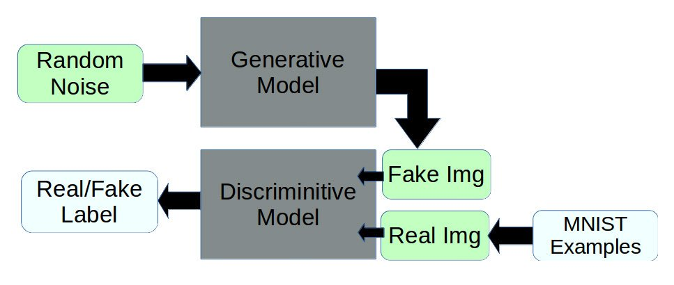

# Simple GAN

This is my attempt to make a wrapper class for a GAN in keras which can be used to abstract the whole architecture process.

- [Simple GAN](#simple-gan)
  - [Overview](#overview)
  - [Flow Chart](#flow-chart)
  - [Credits](#credits)
  - [Contribution](#contribution)
  - [License (MIT)](#license-mit)

## Overview

## Flow Chart

Setting up a Generative Adversarial Network involves having a discriminator and a generator working in tandem, with the ultimate goal being that the generator can come up with samples that are indistinguishable from valid samples by the discriminator.

## Credits

- [Understanding Generative Adversarial Networks](https://towardsdatascience.com/understanding-generative-adversarial-networks-4dafc963f2ef) - Noaki Shibuya
- [Github Keras Gan](https://github.com/osh/KerasGAN)
- [Simple gan](https://github.com/daymos/simple_keras_GAN/blob/master/gan.py)

## Contribution

You are very welcome to modify and use them in your own projects.

Please keep a link to the [original repository](https://github.com/deven96/Simple_GAN). If you have made a fork with substantial modifications that you feel may be useful, then please [open a new issue on GitHub](https://github.com/deven96/Simple_GAN/issues) with a link and short description.

## License (MIT)

This project is opened under the [MIT 2.0 License](https://github.com/deven96/Simple_GAN/blob/master/LICENSE) which allows very broad use for both academic and commercial purposes.

A few of the images used for demonstration purposes may be under copyright. These images are included under the "fair usage" laws.
